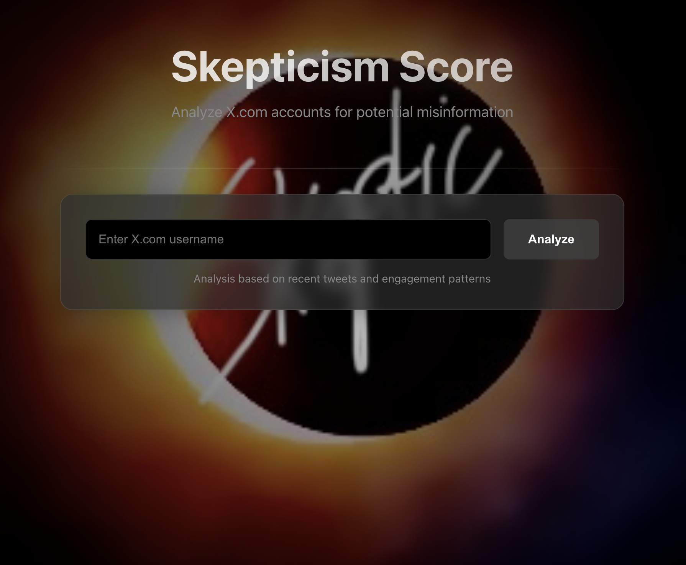

# Skepticism Score

A modern web application that analyzes X.com (Twitter) accounts for potential misinformation using sentiment analysis and engagement patterns.



## Features

- Real-time X.com account analysis
- Misinformation scoring (1-10 scale)
- Beautiful dark mode UI with glass-morphism effects
- Responsive design
- Accessibility support

## Tech Stack

- Frontend: React.js
- Backend: Node.js + Express
- API: Twitter API v2
- Styling: Custom CSS with modern effects

## Prerequisites

- Node.js 14+ and npm
- Twitter API Bearer Token
- Modern web browser

## Environment Variables

Create a `.env` file in the root directory:

```env
TWITTER_BEARER_TOKEN=your_twitter_bearer_token
PORT=5002
```

## Installation

1. Clone the repository:
```bash
git clone https://github.com/yourusername/skepticism-score.git
cd skepticism-score
```

2. Install dependencies:
```bash
# Install backend dependencies
npm install

# Install frontend dependencies
cd client
npm install
```

3. Start the development servers:
```bash
# Start backend (from root directory)
npm start

# Start frontend (from client directory)
cd client
npm start
```

## Deployment

### Backend Deployment (Heroku)
1. Create a new Heroku app
2. Set environment variables in Heroku dashboard
3. Deploy using Heroku Git:
```bash
heroku login
heroku git:remote -a your-app-name
git push heroku main
```

### Frontend Deployment (Vercel)
1. Push your code to GitHub
2. Connect your repository to Vercel
3. Configure build settings:
   - Build Command: `npm run build`
   - Output Directory: `build`
   - Install Command: `npm install`

## API Endpoints

- `GET /health` - Server health check
- `POST /analyze` - Analyze X.com account
  - Body: `{ "username": "twitter_username" }`
  - Response: `{ "score": number, "analyzedTweets": number, "lastAnalyzed": string }`

## Contributing

1. Fork the repository
2. Create your feature branch (`git checkout -b feature/amazing-feature`)
3. Commit your changes (`git commit -m 'Add amazing feature'`)
4. Push to the branch (`git push origin feature/amazing-feature`)
5. Open a Pull Request

## License

This project is licensed under the MIT License - see the [LICENSE](LICENSE) file for details.

## Acknowledgments

- Created by @Divine3rd(https://x.com/divine3rd)
- Design inspired by [skepticism.vercel.app](https://skepticism.vercel.app)
- Twitter API Documentation
- React.js Community 